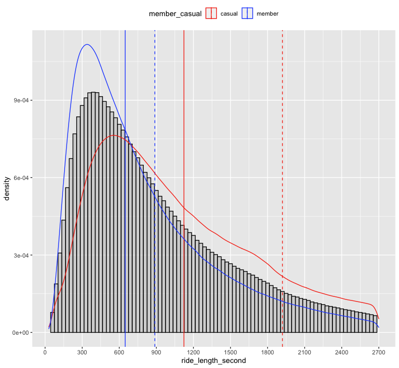
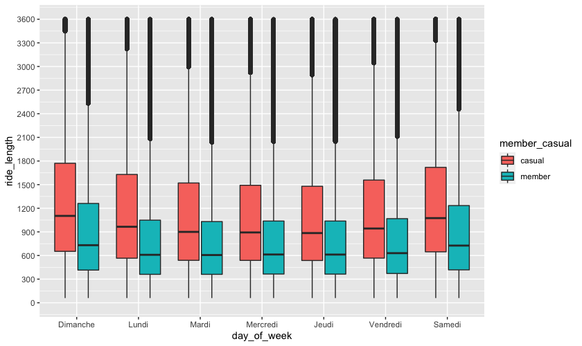
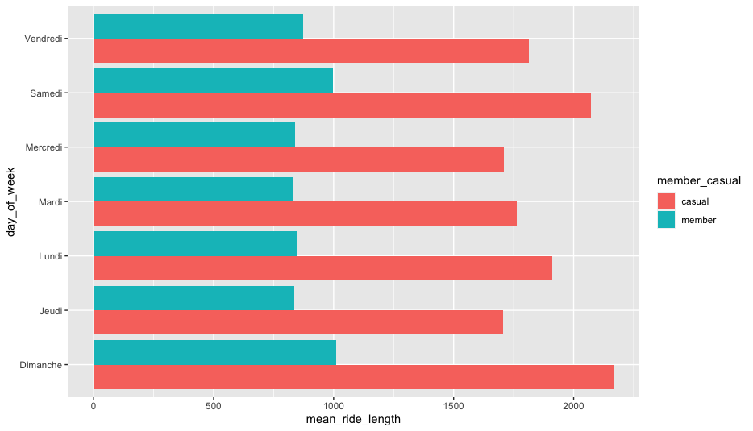
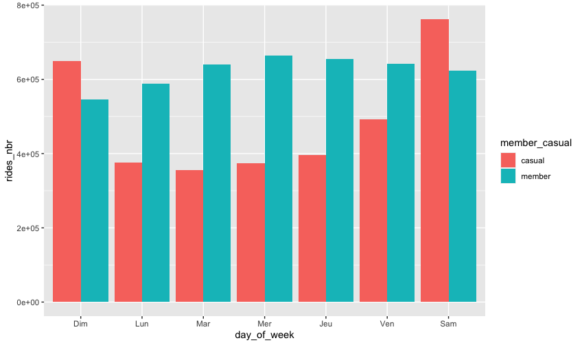
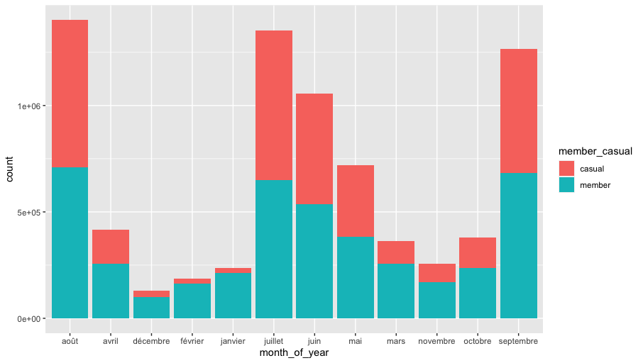

To deliver :
- ASK 1. A clear statement of the business task
- PREPARE 2. A description of all data sources used
- PROCESS 3. Documentation of any cleaning or manipulation of data
- ANALYSE 4. A summary of your analysis
- SHARE 5. Supporting visualizations and key findings
- ACT 6. Your top recommendations based on your analysis


- ASK 1
What is the problem you are trying to solve?
# how to convert casual riders into annual rides?

How can your insights drive business decisions?
# By understanding customer riding behavior between Customers vs Members allow to better target casuals


- PREPARE 2

Data location :'https://divvy-tripdata.s3.amazonaws.com/index.html'
Issue: how to load all those zip file in RStudio and read the data? Should I unzip all files?
# Data are organized in several zip files, we download and gather all zip file manually in one, then upload only 1 meta-zip file (if R studio cloud)
# Investigate and explore several datasets to see the structures/data
  
```{r exploring zip file structure } 
install.packages('vroom') 
library(vroom)

View(vroom(file = 'Divvy_Trips_2019_Q2.zip'))
str(vroom(file = 'Divvy_Trips_2018_Q2.zip'))
spec(vroom(file ='Divvy_Stations_Trips_2013.zip'))

```
  
  
# Several types of files/folder are given: 
  - "YYYMM-divvy-tripdata" = give us infos about Stations, Riders & their Trips for years 2020 to 2021 (issue of NA,on 'start and end stations name/id' since MAY 2021)
  (all included data except personal infos of the rider)
  - same for files "Divvy_Trips_YYYY_QX" = giving us the same infos but DIFFERENT structures from 2018 to Q1 2020 
  (noticed missing value for non membership)
  - then files like "Divvy_Trips_YYYY_QXQX" = give us seperate csv between Trips and Stations from 2015 to 2017 
  (noticed missing value for non members) + Readme infos
  - for year 2014 we have files "Divvy_Stations_Trips_2014_QXQX" with Stations infos on xlsx and Trips on csv + Readme 
  (noticed missing value for non members) + Readme infos
  - for 2013 there is one file  "Divvy_Stations_Trips_2013" giving us split infos on Stations and Trips  
  (missing gender and birthday) + Readme infos

We can see a difference of collected data and features between 2020/2021 versus older records. Some data records looks Reliable with accurate information, from the Original source, Comprehensive, Current and Cited. With this data we will be able to find metrics for any differentiation from Casuals to Members habits.


Data integrity/issues
# Several assumptions were made until 2017's records; some informations are missing between 2013-2019 files vs 2020/2021; the company changed some name features and metrics along years, we can know in clear the 'gender' of and 'birth of date' of each members (< 2020's file)

# Assumptions: we should only consider the 2020/2021 data in order to base our analysis on reliable and current data. (no need to unzip). We aslo encounter NA in 2021 file, we need to determine what data cleaning suit the best for it.

# However knowing the Covid pandemic influence, it would be interesting to dig also the data of 2018/2019 (and even older), even if some missing values and features are a bit different. It would help determine if the Covid might had an impact or not on the business, and how the business evolved along the time. We will first focus on recent records in order to avoid manual changes on excel files and see if any patterns of behaviour can be found and confirmed later.


Gathering all data in one data set in order to apply later, quicker changes on column

```{r gathering all data} 

#gather zip files in one data set
df_20_21 <- rbind(
  q1_20, april_20, may_20, june_20, july_20, august_20, september_20, october_20, november_20, december_20, 
  january_21, february_21, march_21, april_21, may_21, june_21, july_21, august_21, september_21
  )

```


- PROCESS 3
We could unzip and rename files, but it would be faster to just create new dataset by gathering all 20/21 records due to the same structures of data. By using R in Rstudio, I think it would be faster than go through each excel in order to manipulate data manually (by using vroom package to read zip files).

I started to preview data through tables and statistics, to see where data needs cleaning, specially missing values regarding Stations infos that are clearly appearing. Also I verify if the data has accurate complete, accurate and relevant information.

```{r exploring gathered dataset to find metadata } 

glimpse(df_20_21)
describe(df_20_21)
skim_without_charts(df_20_21)
sapply(df_20_21, mean , na.rm=TRUE) 
```


Creation of extra metric in order push the analysis: 
- length riding, to be converted in comprehensive time
- weekly days, to find some potential day seasonality

```{r metric creation }  


### Calculating duration of each rides
ride_length <- time_length(interval(start = df_20_21$started_at, end = df_20_21$ended_at)) #rides duration in seconds
df_20_21 <- mutate(df_20_21, ride_length_second = ride_length)  #adding new column to df
df_20_21 <- mutate(df_20_21, ride_length = seconds_to_period(ride_length)) # converting second to period

### Day of the week
day_of_week <- weekdays(df_20_21$started_at) #conversion datetime to days of week
month_of_year <- format(df_20_21$started_at, format = "%B") # extracting month in string
year_of_data <- format(df_20_21$started_at, format = "%Y") # extracting year

### Assemble those metrics to the data set
df_20_21 <- mutate(df_20_21, day_of_week = day_of_week, year_of_data = year_of_data, month_of_year = month_of_year)

```


Cleaning data (NA, special character, doublons, extreme values, etc.)

```{r cleaning data}  

#Find where data is an issue
clean_names(df_20_21)
which(is.na(df_20_21),arr.ind=TRUE)
df_status(df_20_21) # retrieve quantity data to be clean
gg_miss_var(df_20_21) # visualize missing values

#double values
doublon_ride_id <- data.frame(df_20_21$ride_id) #select only ride_id
duplicated_data <- duplicated(doublon_ride_id) #find only doublon, ouput is true/false list
df_20_21_with_dbl <- cbind(is_doublon = duplicated_data, df_20_21) 
df_20_21_without_dbl <- (distinct(df_20_21_with_dbl, ride_id, .keep_all=TRUE)) #keep only unique rows, and create new df

#Extreme values
df_20_21_without_dbl_no_xtrm <- df_20_21_without_dbl[between(df_20_21_without_dbl$ride_length_second, 60, 86400) , ] #Keeping only "normal values"

```
# I don't need to fill, replace, delete NA due to the fact that missing informations are concerning stations id/names. 
# Some doublons of ride_id appear twice with strange informations, I decide to remove duplicated values.
# Extreme values appear , cut non sense data (negativ durations, very low ride duration and very high ride duration)


- ANALYSE 4

Exploring cleaned data set to find relevant statistics or information related to customer type:
- how is the distribution, where is the mean, median, mode, min/max etc.

```{r exploring cleaned data}  

stat.desc(df_20_21_without_dbl_no_xtrm)
mean(df_20_21_without_dbl_no_xtrm$ride_length_second) #calculation of ride length mean
median(df_20_21_without_dbl_no_xtrm$ride_length_second) #calculation of ride length median
max(df_20_21_without_dbl_no_xtrm$ride_length_second)
min(df_20_21_without_dbl_no_xtrm$ride_length_second)

```


- trying different calculation about customer type metrics

```{r calculate metrics per customer type}  

mfv(df_20_21_without_dbl_no_xtrm$day_of_week, na_rm = TRUE) #calculating mode/most frequent value of day
tabyl(df_20_21_without_dbl_no_xtrm, member_casual, day_of_week) #counting higher frequency of observations per days per type of customer
aggregate(df_20_21_without_dbl_no_xtrm[, "ride_length_second"], list(df_20_21_without_dbl_no_xtrm$day_of_week), mean) #Calcul of the length duration mean per day's week
aggregate(df_20_21_without_dbl_no_xtrm$ride_length_second ~ df_20_21_without_dbl_no_xtrm$member_casual, FUN = median) #Calcul of the median lenght duration per customer type
aggregate(df_20_21_without_dbl_no_xtrm$ride_length_second ~ df_20_21_without_dbl_no_xtrm$member_casual + df_20_21_without_dbl_no_xtrm$day_of_week, FUN = mean) #Mean per day per type of customer

#create a synthesis of some metrics 

mean_to_plot <- ddply(df_20_21_without_dbl_no_xtrm,c("day_of_week","member_casual") ,summarise, mean_ride_length = mean (ride_length_second)) 

```
I sum up different keys findings with the plots.


_ SHARE 5

Presenting the most important findings:


- Distribution of ride length observation, by customer type

```{r distribution plot, echo=FALSE, fig.height=2.7, fig.width=9, out.width="400px", dpi=120} 



```


The histogram represent the ride duration in second, according to the density of observations.
The plot is cut after 2700 sec ride length duration (45min) , because most of the data are below this duration.

Each peak of distribution are located differently (curves):
for members in blue, we can see it around 300-400 second, where for the casuals in red is located around 500-600 second.

We can say that, most members tend to ride a shorter time than casuals customers (blue curve going under red till the end).
In solid vertical line, are draw the median, which means for blue, that 50% of observations for members are below ~700sec while for red casuals we are around 1100 sec ride length. 

Finally for the dashed vertical line which represents the average duration of ride per group, we can notice a greater gap with the average of casuals that the one from member. By calculating the standard deviation we can fall on the same relation, where sd(casual) ~= 3 * sd(member). 
It can be explained by the fact that some observations for casuals, tend to have some much higher ride duration in global.
So members tend to ride shorter time than casuals but maybe more frequently? (56% of observations are members)


- Number of rides length per day per week day customer type

```{r daily customer plot, echo=FALSE, fig.height=2.7, fig.width=9, out.width="400px", dpi=120} 



```


We can see here the ride length in second, splited per days of the week.
The box plot shows that the 3 quartile of each days for both group of customer type, are mostly contain under the 1600 second ride length (~26min). 
We can also clearly see a higher median for casual group and a higher ride duration for weekend days (saturday and sunday).
However we can noticed that during week days (Monday to Friday) members has a 4th quartile starting earlier (around 2000 second ride length).


- Average ride duration per days
```{r daily customer average ride plot, echo=FALSE, fig.height=2.7, fig.width=9, out.width="400px", dpi=120} 



```

I calculate here the average ride length per day. We can clearly see how casuals ride duration is higher every day versus members. Also the peak during Saturday and Sunday are visible between both group but also for casual where the difference between week or weekend days are significant


- Number of rides per day per week days per customer type

```{r daily customer average ride plot, echo=FALSE, fig.height=2.7, fig.width=9, out.width="400px", dpi=120} 



```

We can see for each day of a week, how many people are taking bicycle. The difference we can noticed here is that members ride more during week days than casuals riding more during week end days.


- Number of rides permonth per customer type

```{r month customer ride plot, echo=FALSE, fig.height=2.7, fig.width=9, out.width="400px", dpi=120} 



```

Here we can notices the impact of the summer time on the rides split (excluding october to december data).
The top riding months, are from May to September.


- ACT 6

Recommendations:

For most of the riders, members of Cyclistic tend to use more the bicycle during week days, for shorter duration than casual riders. During the weekend we can see than both group use more bicycles, but specially casual riders with a high peak of utilization, we can also noticed that some casual riders look to use bicycle for longer time (several hours) compare to members (excluding >24 hours uses).

We could say that members are mainly using bicycle for small or short travel with a regular or specific need, to go to work for instance. Whereas casual riders are using more bicycle as opportunities or one shot, for example: to enjoy weather, do some sport, meet people, changing from other transportation mode etc. 

# We have to consider what stops would prevent a casual rider to become a member. We can think about the price and constraints that having a membership would impact the customer.The casual customer that does not need to ride everyday a bike, will not subscribe Then offering only a one shot or annual offer won't fit the best it's need.

# Several possibilities may help to convert, from one shot riding, to a more regular offer inorder to turn casuals, to loyal one's and maybe in the end to an annual membership.

# Creating different subscription formulas (that would be cheaper than membership in the  total amount, but more advantageous than single ride or per minute) according to the needs we noticed through the anaylsis process: 
> A "week-end pass" where you 'members' can ride freely all the week-ends of the year.
> A "short run pass" which allow 'members' to have the first 25min with discount prices/min twice a day with minimum time between rides, for the full year.
> A "summer annual boost" allowing members to ride freely from May to September, with a small advantages on the rest of the year

# If some data bout casuals riders would have been available, we could have analyze how often their are using the service, in order to search for potential casuals that using several time the bicycle without being a member. It would help targeting or understanding some behaviours or people.
> Does Casuals data are or could be gathered in a way that we can track the number of unique id using several time the service ? (for example free creation account with few advantages on next rides if not member, then sign in to a extra free minutes for eg.)


